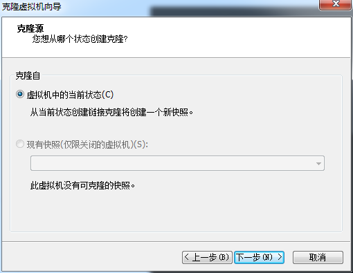
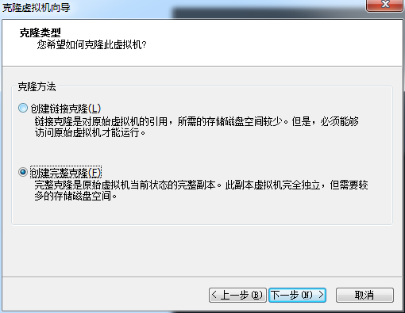
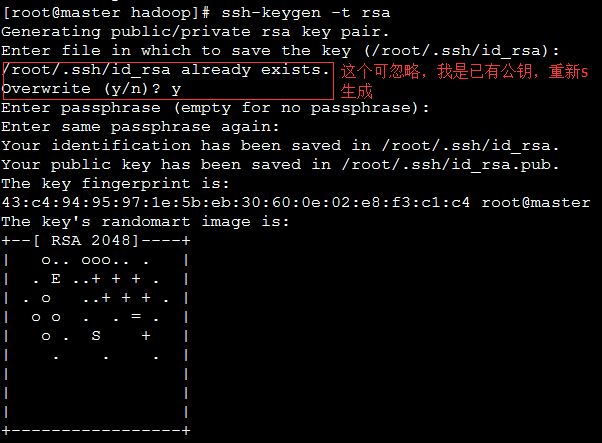
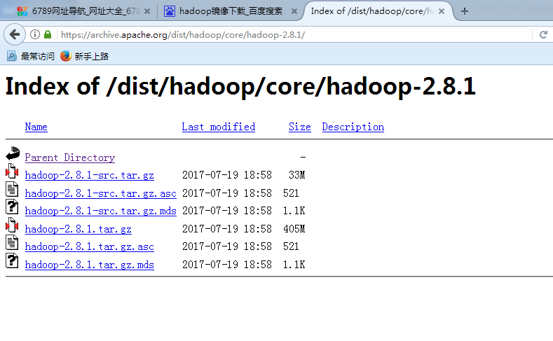
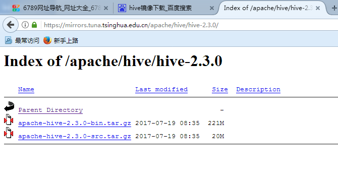
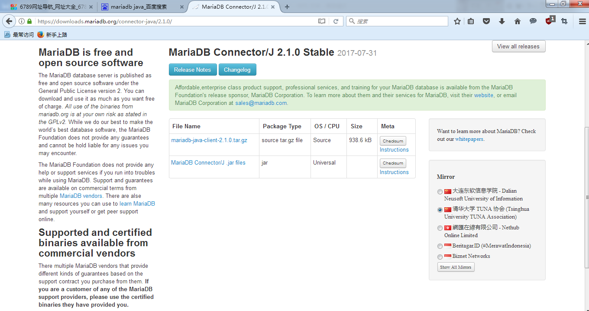
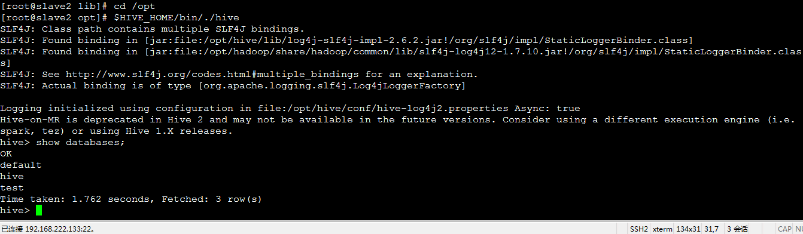
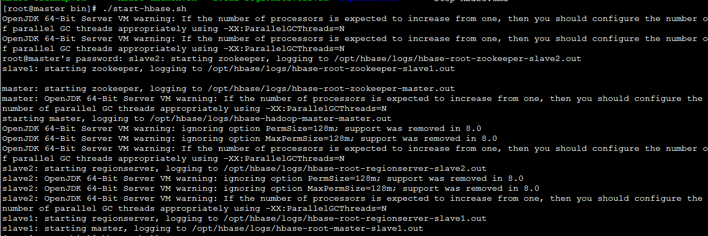
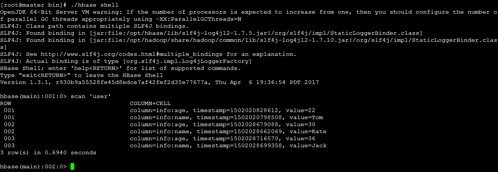

本文所用VMWare创建虚拟机，Linux选用CentOS7系统，配置为1G内存，20G硬盘（可根据电脑配置自行配置大小）。命令均使用root用户下的，下文$仅是指linux命令，
#即是标注。系统用户名设定为hadoop。

一、虚拟机相关配置  
1.设置静态IP  
（1）修改/etc/sysconfig/network-scripts/ifcfg-eth0  
$vim /etc/sysconfig/network-scripts/ifcfg-eth0  
#内容如下：  
DEVICE=eth0   #设备名称  
BOOTPROTO=static  #静态IP  
IPADDR=192.168.222.131  
NETMASK=255.255.255.0  #子网掩码  
GATEWAY=192.168.222.2   
HWADDR=00:50:56:27:43:CD  #MAC地址  
ONBOOT=yes  #开机自启动  
TYPE=Ethernet  #网络类型  
IPV6INIT=no  
DNS1=192.168.222.2  

（2）修改/etc/sysconfig/network  
$vim /etc/sysconfig/network  
NETWORKING=yes  #是否利用网关  
NETWORKING_IPV6=no  
HOSTNAME=master  #主机名  
GATEWAY=192.168.222.2  #默认网关  

（3）修改DNS信息  
$vim /etc/resolv.conf  
nameserver 192.168.222.2  
#使配置信息立即生效  
$source /etc/resolv.conf  
#重启网络服务  
$service network restart  

（4）关闭防火墙并修改其启动策略为不开机启动（CentOS7默认firewall作为防火墙）  
#停止firewall  
$systemctl stop firewalld.service   
#禁止firewall开机启动  
$systemctl disable firewalld.service  

2.安装JDK  
（1）使用yum search jdk在线查找jdk，可任意选择版本安装，这里选用java-1.8.0-openjdk-devel.x86_64。  
$yum search jdk  
$yum install java-1.8.0-openjdk-devel.x86_64 -y  

（2）配置java环境变量  
#查询JDK路径  
$whereis java  
#修改配置文件  
$vim /etc/profile  
#在末尾追加  
export JAVA_HOME="/usr/lib/jvm/java-1.8.0-openjdk-1.8.0.131-3.b12.  
el7_3.x86_64"  
export JRE_HOME="$JAVA_HOME/jre"  
export PATH="$JAVA_HOME/bin:$PATH"  
 export CLASSPATH=".:$JAVA_HOME/lib/dt.jar:$JAVA_HOME/lib/tools.jar"  
#保存并使之生效  
$source /etc/profile  

（3）查看配置是否成功  
$java -version  

3.克隆两台机器  
在VMWare软件菜单栏，选“虚拟机”->“管理”->“克隆”，如下图：  

 
 
 
 

之后，分别配置两台机器的静态IP，主要修改/etc/sysconfig/network-scripts/ifcfg-eh0，将ifcfg-eth0改为不同的名字，并在文件内更改IPADDR和HWADDR
（MAC地址，根据机器而定），这里分别配置IP为192.168.222.132，192.168.222.133。  

4.配置ssh免登陆  
（1）启动三台机器，分别修改主机名为master,slave1,slave2（sudo hostname master）,并修改如下。  
$vim /etc/sysconfig/network  
#内容如下：  
NETWORKING=yes   
NETWORKING_IPV6=no  
HOSTNAME=master  
GATEWAY=192.168.222.2  

（2）修改master上的/etc/hosts  
#添加如下内容：  
192.168.222.131 master  
192.168.222.132 slave1  
192.168.222.133 slave2  

（3）将nerwork和hosts文件复制到slave1,slave2dengtong.  
$sudo scp /etc/sysconfig/network root@slave1:/etc/sysconfig  
$sudo scp /etc/hosts root@slave1:/etc  

（4）在master上使用hadoop用户登录，执行$ssh-keygen -t rsa命令产生公钥。  
$ssh-keygen -t rsa  
  

（5）将公钥复制到slave1和slave2上（这里输入slave1和slave2密码）。  
$ssh-copy-id -i ~/.ssh/id_rsa.pub slave1  
$ssh-copy-id -i ~/.ssh/id_rsa.pub slave2  
之后master机器上直接输入ssh slave1即可登录slave1。  

网卡无法正常运行常见解决方法：  
1.service  network restart  
2.删除/etc/sysconfig/network-scripts下的70-persistent-net.rules  
3. systemctl stop NetworkManager  
systemctl disable NetworkManager  

二、hadoop配置  
1.hadoop下载、安装  
这里通过镜像下载，所安装为最新的稳定版[hadoop-2.8.1.tar.gz](https://archive.apache.org/dist/hadoop/core/hadoop-2.8.1/hadoop-2.8.1.tar.gz),如下图，通过Xftp存到master机器/home/hadoop/tmp上，
随后放到指定目录并解压安装。  
$mv /home/hadoop/tmp/hadoop-2.8.1.tar.gz /opt/  
$tar -zvxf hadoop-2.8.1.tar.gz  
#将解压文件重命名hadoop  
$mv hadoop-2.8.1.tar.gz hadoop  

 
 
2.配置环境变量  
$vim ~/.bashrc  
export HADOOP_PREFIX="/opt/hadoop"  
export HADOOP_COMMON_HOME=$HADOOP_PREFIX  
export HADOOP_HDFS_HOME=$HADOOP_PREFIX  
export HADOOP_MAPRED_HOME=$HADOOP_PREFIX  
export HADOOP_YARN_HOME=$HADOOP_PREFIX  
export HADOOP_CONF_DIR=$HADOOP_PREFIX/etc/hadoop  
export PATH=$PATH:$HADOOP_PREFIX/bin:$HADOOP_PREFIX/sbin  

3.修改hadoop-env.sh，加入jdk目录  
$cd /opt/hadoop/etc/hadoop/  
$vim hadoop-env.sh  
export JAVA_HOME="/usr/lib/jvm/java-1.8.0-openjdk-1.8.0.131-3.  
b12.el7_3.x86_64"  

4.修改配置文件core-site.xml  
$vim /opt/hadoop/etc/hadoop/core-site.xml  

<configuration>  

    <property>  
        <name>fs.defaultFS</name>  
        <value>hdfs://master:9000</value>  
    </property>  
    <property>  
        <name>hadoop.tmp.dir</name>  
        <value>/home/hadoop/hd/tmp/hadoop-${user.name}</value>  
    </property>  

</configuration>  

5.修改配置文件hdfs-site.xml  
$vim /opt/hadoop/etc/hadoop/hdfs-site.xml
  
<configuration>  

    <property>  
         <name>dfs.namenode.name.dir</name>  
         <value>file:///home/hadoop/hd/hdfs/namenode</value>  
    </property>  
    <property>  
         <name>dfs.datanode.data.dir</name>  
         <value>file:///home/hadoop/hd/hdfs/datanode</value>  
    </property>  
    <property>  
         <name>dfs.namenode.checkpoint.dir</name>  
         <value>file:///home/hadoop/hd/hdfs/namesecondary</value>  
    </property>  
    <property>  
         <name>dfs.replication</name>  
         <value>2</value>  
    </property>  
	
</configuration>  

6.修改配置文件yarn-site.xml  
$vim /opt/hadoop/etc/hadoop/yarn-site.xml  

<configuration>  

    <property>  
        <name>yarn.nodemanager.aux-services</name>  
        <value>mapreduce_shuffle</value>  
     </property>  
     <property>  
        <name>yarn.resourcemanager.hostname</name>  
        <value>master</value>  
     </property>  
     <property>  
        <description>The address of the applications manager interface in the RM.</description>  
        <name>yarn.resourcemanager.address</name>  
        <value>${yarn.resourcemanager.hostname}:8032</value>  
     </property>  
     <property>  
        <description>The address of the scheduler interface.</description>  
        <name>yarn.resourcemanager.scheduler.address</name>  
        <value>${yarn.resourcemanager.hostname}:8030</value>  
     </property>  
     <property>  
        <description>The http address of the RM web application.</description>  
        <name>yarn.resourcemanager.webapp.address</name>  
        <value>${yarn.resourcemanager.hostname}:8088</value>  
     </property>  
     <property>  
        <description>The https adddress of the RM web application.</description>  
        <name>yarn.resourcemanager.webapp.https.address</name>  
        <value>${yarn.resourcemanager.hostname}:8090</value>  
     </property>  
     <property>  
        <name>yarn.resourcemanager.resource-tracker.address</name>  
        <value>${yarn.resourcemanager.hostname}:8031</value>  
     </property>  
     <property>  
        <description>The address of the RM admin interface.</description>  
        <name>yarn.resourcemanager.admin.address</name>  
        <value>${yarn.resourcemanager.hostname}:8033</value>  
     </property>  

     <property>  
        <name>yarn.scheduler.maximum-allocation-mb</name>  
        <value>1024</value>  
        <discription>每个节点可用内存,单位MB,默认8182MB</discription>  
     </property>  
     <property>  
        <name>yarn.nodemanager.vmem-pmem-ratio</name>  
        <value>2.1</value>  
     </property>  
     <property>  
        <name>yarn.nodemanager.resource.memory-mb</name>  
        <value>1024</value>  
     </property>  
     <property>  
        <name>yarn.nodemanager.vmem-check-enabled</name>  
        <value>false</value>  
     </property>
	 
</configuration>  

7.修改配置文件mapred-site.xml  
$vim /opt/hadoop/etc/hadoop/mapred-site.xml  

<configuration>

    <property>
       <name>mapreduce.framework.name</name>
       <value>yarn</value>
    </property>
    <property>
       <name>mapreduce.jobtracker.staging.root.dir</name>
       <value>/home/hadoop/hd/var</value>
    </property>
    <property>
       <name>mapreduce.job.tracker</name>
       <value>master:49001</value>
    </property>
	
</configuration>

上述配置在三台机器上相同。  

8.格式化hdfs  
$hdfs namenode -format  

9.启动hadoop  
$start-all.sh （或是分别启动start-dfs.sh和start-yarn.sh）  

之后就可以正常使用hdfs，常见命令如下：  
新建文件夹：hdfs –mkdir –p /user/root/tmp/  
查看权限：hdfs –ls –d /user/root  
上传文件：hdfs –put /home/tmp.txt /user/root/  

常见问题：  
1.Datanode未正常启动，可查看配置文件是否有误，或单节点未启动，在该节点启动datanode服务，或清除data,pids,temp,name文件，重新格式化hdfs  
2.执行mapreduce的wordcount，需使虚拟机内存至少达到1.5G内存，不然执行报错  

三、hive配置  
1.hive下载、安装  
这里通过镜像下载，所安装为最新的稳定版[apache-hive-2.3.5-bin.tar.gz](https://mirrors.tuna.tsinghua.edu.cn/apache/hive/hive-2.3.5/apache-hive-2.3.5-bin.tar.gz),如下图，通过Xftp存到slave2机器/home/hadoop/tmp上，随后放到指定目录并解压安装。  
$mv /home/hadoop/tmp/apache-hive-2.3.5-bin.tar.gz /opt/  
$tar -zvxf apache-hive-2.3.5-bin.tar.gz  
#将解压文件重命名hadoop  
$mv apache-hive-2.3.5-bin.tar.gz hive  
 
 
2.配置hive-site.xml（没有的话，可将hive-site.xml.template复制一份，更名）  
$cd /opt/hive/conf  
$cp hive-site.xml.template hive-site.xml  
$vim hive-site.xml  

<configuration>  

    <property>  
        <name>javax.jdo.option.ConnectionURL</name>  
        <value>jdbc:mysql://192.168.222.133:3306/hive?createDatabaseIfNotExist=true</value>  
    </property>  
    <property>  
        <name>javax.jdo.option.ConnectionDriverName</name>  
        <value>org.mariadb.jdbc.Driver</value>  
    </property>  
    <property>  
        <name>javax.jdo.option.ConnectionUserName</name>  
        <value>hive1</value>  
    </property>  
    <property>  
        <name>javax.jdo.option.ConnectionPassword</name>  
        <value>hive1</value>  
    </property>  
    <property>  
        <name>hive.metastore.schema.verification</name>  
        <value>false</value>  
    </property>  
    <property>  
        <name>hive.metastore.warehouse.dir</name>  
        <value>hdfs://master:9000/user/hive/warehouse</value>  
    </property>  
    <property>  
        <name>hive.exec.local.scratchdir</name>  
        <value>/home/hadoop/hd/data/hive/scratchdir</value>  
    </property>  
    <property>  
        <name>hive.downloaded.resources.dir</name>  
        <value>/home/hadoop/hd/data/hive/resourcesdir</value>  
    </property>  
    <property>  
        <name>hive.querylog.location</name>  
        <value>/home/hadoop/hd/data/hive/querylog</value>  
    </property>  
    <property>  
        <name>hive.server2.logging.operation.log.location</name>  
        <value>/home/hadoop/hd/data/hive/operation</value>  
    </property>  
  
</configuration>  

3.修改/etc/profile文件，添加必要环境变量。  
$vim /etc/profile  
export HADOOP_HOME="/opt/hadoop"  
export HIVE_HOME="/opt/hive"  
export PATH="$HIVE_HOME/bin:$PATH"  

4.复制相关jar包。  
（1）把mariadb驱动包（mariadb-java-client-2.4.2.jar）拷到hive的lib目录（下载链接：[mariadb-java-client-2.4.2.jar](https://downloads.mariadb.com/Connectors/java/connector-java-2.4.2/mariadb-java-client-2.4.2.jar),通过Xftp传到  
/home/hadoop/tmp）（mariadb安装在小节后面）  
 
 
$cp /home/hadoop/tmp/mariadb-java-client-2.4.2.jar /opt/hive/lib  
（2）将hive的lib下jline包拷贝到/opt/hadoop/share/hadoop/yarn/lib下，并删除旧版本jline包。  
$cp /opt/hive/lib/jline-2.12.jar /opt/hadoop/share/hadoop/yarn/lib  

5.初始化hive数据库
前提是下面的mariadb数据库已经安装配置好，并完成下面命令，命令为mariadb下
CREATE DATABASE hive; 
USE hive; 
CREATE USER 'hive'@'localhost' IDENTIFIED BY 'hive';
GRANT ALL ON hive.* TO 'hive'@'localhost' IDENTIFIED BY 'hive'; 
GRANT ALL ON hive.* TO 'hive'@'%' IDENTIFIED BY 'hive'; 
FLUSH PRIVILEGES; 
quit;

之后在hive主目录下执行初始化命令
schematool -dbType mysql -initSchema

6.启动hive  
$$HIVE_HOME/bin/./hive  

之后进入hive中，即可使用hive数据库（操作等同mysql）,如下图。  
  

常见问题：  
1.报“Access denied …”，更换数据库用户名及密码，并更改配置  
2../bin/schematool -initSchema -dbType mysql，避免“MetaException(message:Hive metastore database is not initialized…”错误。  

补充mariadb安装：  
1、安装MariaDB  
安装命令  
yum -y install mariadb mariadb-server  

安装完成MariaDB，首先启动MariaDB  
systemctl start mariadb  

设置开机启动  
systemctl enable mariadb  

接下来进行MariaDB的相关简单配置  
mysql_secure_installation  

首先是设置密码，会提示先输入密码  
Enter current password for root (enter for none):<–初次运行直接回车  

设置密码  
Set root password? [Y/n] <– 是否设置root用户密码，输入y并回车或直接回车  
New password: <– 设置root用户的密码  
Re-enter new password: <– 再输入一次你设置的密码  

其他配置  
Remove anonymous users? [Y/n] <– 是否删除匿名用户，回车  
Disallow root login remotely? [Y/n] <–是否禁止root远程登录,回车,  
Remove test database and access to it? [Y/n] <– 是否删除test数据库，回车  
Reload privilege tables now? [Y/n] <– 是否重新加载权限表，回车  
初始化MariaDB完成，接下来测试登录  
mysql -uroot -ppassword  
完成。  
 
2、配置MariaDB的字符集  
文件/etc/my.cnf  
vi /etc/my.cnf  
在[mysqld]标签下添加  
init_connect='SET collation_connection = utf8_unicode_ci'   
init_connect='SET NAMES utf8'   
character-set-server=utf8   
collation-server=utf8_unicode_ci   
skip-character-set-client-handshake  

文件/etc/my.cnf.d/client.cnf  
vi /etc/my.cnf.d/client.cnf  
在[client]中添加  
default-character-set=utf8  

文件/etc/my.cnf.d/mysql-clients.cnf  
vi /etc/my.cnf.d/mysql-clients.cnf  
在[mysql]中添加  
default-character-set=utf8  
 全部配置完成，重启mariadb  
systemctl restart mariadb  

之后进入MariaDB查看字符集  
mysql> show variables like "%character%";show variables like "%collation%";  
显示为 

+--------------------------+----------------------------+  
| Variable_name            | Value                      |  
+--------------------------+----------------------------+  
| character_set_client    | utf8                      |  
| character_set_connection | utf8                      |  
| character_set_database  | utf8                      |  
| character_set_filesystem | binary                    |  
| character_set_results    | utf8                      |  
| character_set_server    | utf8                      |  
| character_set_system    | utf8                      |  
| character_sets_dir      | /usr/share/mysql/charsets/ |  
+--------------------------+----------------------------+  
8 rows in set (0.00 sec)  
+----------------------+-----------------+  
| Variable_name        | Value          |  
+----------------------+-----------------+  
| collation_connection | utf8_unicode_ci |  
| collation_database  | utf8_unicode_ci |  
| collation_server    | utf8_unicode_ci |  
+----------------------+-----------------+  
3 rows in set (0.00 sec)  
字符集配置完成。  
 
3、添加用户，设置权限  
创建用户命令  
mysql>create user username@localhost identified by 'password';  

直接创建用户并授权的命令  
mysql>grant all on *.* to username@localhost indentified by 'password';  

授予外网登陆权限    
mysql>grant all privileges on *.* to username@'%' identified by 'password';  

授予权限并且可以授权  
mysql>grant all privileges on *.* to username@'hostname' identified by 'password' with grant option;  

简单的用户和权限配置基本就这样了。  
其中只授予部分权限把 其中 all privileges或者all改为select,insert,update,delete,create,drop,index,alter,grant,references,reload,  
shutdown,process,file其中一部分。  

四、hbase配置  
1.hbase下载、安装  
这里通过镜像下载，所安装为最新的稳定版 [hbase-1.3.1-bin.tar.gz](https://mirrors.tuna.tsinghua.edu.cn/apache/hbase/1.3.1/hbase-1.3.1-bin.tar.gz),如下图，通过Xftp存到master机器/home/hadoop/tmp上  
（配置好后可用sudo scp将hbase文件包复制到另外两台机器上），随后放到指定目录并解压安装。  
$mv /home/hadoop/tmp/hbase-1.3.1-bin.tar.gz /opt/  
$tar -zvxf hbase-1.3.1-bin.tar.gz  
#将解压文件重命名hadoop  
$mv hbase-1.3.1-bin.tar.gz hbase  

2.配置/opt/hbase/conf/hbase-site.xml  
$vim /opt/hbase/conf/hbase-site.xml  

<configuration>  

    <property>  
       <name>hbase.cluster.distributed</name>  
       <value>true</value>  
    </property>  
    <property>  
       <name>hbase.rootdir</name>  
       <value>hdfs://master:9000/hbase</value>  
    </property>  
    <property>  
       <name>hbase.master</name>  
       <value>master:60000</value>  
    </property>  
    <property>  
       <name>hbase.zookeeper.quorum</name>  
       <value>master,slave1,slave2</value>  
    </property>  
    <property>  
       <name>hbase.zookeeper.property.dataDir</name>  
       <value>/home/hadoop/hd/zookeeper</value>  
    </property>  
    <property>  
       <name>hbase.zookeeper.property.clientPort</name>  
       <value>2181</value>  
    </property>  
  
</configuration>  

3.修改/opt/hbase/conf/hbase-env.sh，加入jdk目录  
$vim /opt/hbase/conf/hbase-env.sh  
export JAVA_HOME="/usr/lib/jvm/java-1.8.0-openjdk-1.8.0.131-3.  
b12.el7_3.x86_64"  

4.修改/opt/hbase/conf/regionservers（regionserver服务所在节点）  
$vim /opt/hbase/conf/regionservers  
slave1  
slave2  

5.在/opt/hbase/conf/下添加backup-masters文件（备份所在节点）  
$vim /opt/hbase/conf/backup-masters  
slave1  

6.启动hbase相关服务，并进入hbase数据库,如下图。  
$cd /opt/hbase/bin  
$./start-hbase.sh  
$./hbase shell  
 
 
 
 

常见问题：  
1.创建表时，报“can‘t get master address from zookeeper znode = null …”， 查看hbase.rootdir 与core-site.xml中fs.defaultFS端口是否一致，  
若一致，可格式化hdfs即可正常启动。  
2. 报错“STOPPED: Unhandled: org.apache.hadoop.hbase.ClockOutOfSyncException:Server tracing026,60020,1420362977338 has been rejected;  
 Reported time is too far out of sync with master.  Time difference of 55987ms > max allowed of 30000ms…”，同步各节点时间即可。  

